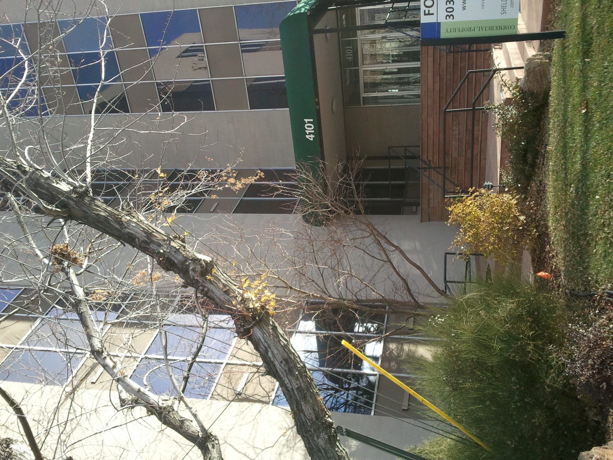
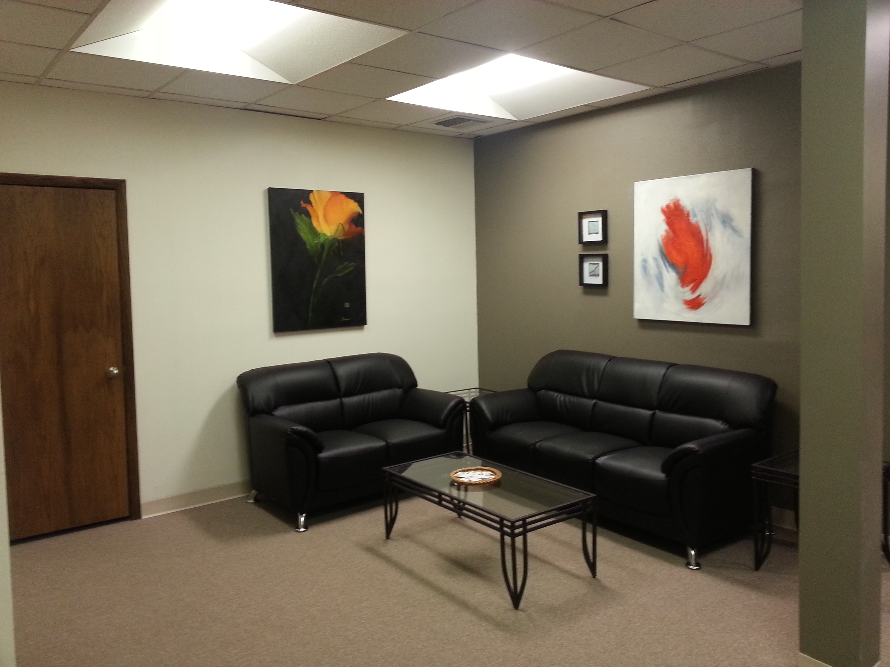

	<section id="one">
		

			<ul class="actions">
				<li>
Real Estate
</li>
				<li>
Startups
</li>
				<li>
Product Development
</li>
				<li>
Persona
</li>
				<li>
B2B Sales
</li>
				<li>
Marketing
</li>
			</ul>
      <header class="major">
				<h2>Background</h2>
			</header>
      
<i>LMD Management is a full service real estate investment and operations company operating in Denver, Colorado.</i>

			
In 2010, the commercial real estate market was at the height of the Great Recession and banks were desperately looking for buyers to take foreclosed off of their balance sheets.

				At this time, a bank came to us to ask if we would be interested taking over a C class building in Denver, Colorado for roughly 40 cents on the dollar. We agreed. The case study below outlines:
	    <ul>
	    <li>How we identified a user problem</li>
	    <li>How I built and marketed a product for the problem</li>
	    <li>How we were able to increase revenue 3X at the height of the recession</li>
	    </ul>

		

	</section>
<section id="two" class="spotlights">
	<section>
		
		

			

				<header class="major">
					<h3>Problem</h3>
				</header>
				
We took over a building in December of 2010 that was 40% full with tenants and existing leases. After drastically cutting expenses and bringing in our own group of vendors, I was able to make the building break even based upon the strength of our financing and creative leasing of our parking lot and roof top space to larger companies.

        We then realized that if the building was to be cash flow positive we would need to figure out how get tenants to sign leases and move in. The problem was that in 2010, commercial real estate leases were:
        <ul>
	        <li>Expensive ($18/sqft)</li>
					<li>Big (minimum 1000 sqft)</li>
	        <li>Long (3-5 years)</li>
	        <li>Complicated (Require lawyers to negotiate)</li>
				</ul>
        
With so much uncertainty in the economy, no one was going to sign an expensive long term lease. However, we did believe that people would be willing to sign a lease if it meant that they were betting on themselves.

			

		

	</section>
  <section>
			
		

			

				<header class="major">
					<h3>Solution</h3>
				</header>
				
So rather than go after the SMBs and SMEs that dominate C class real estate, we did an analysis and thought to ourselves <blockquote cite="http://">
						Who actually wants and office right now?
				</blockquote> What we determined was that the person who was most likely wanted an office was probably someone who:

				<ul>
					<li>Had their own small business and no longer wanted to work from home.</li>
					<li>Was frustrated with the job market and wanted to start their own business.</li>
				</ul>
				<header class="major">
					<h3>Product</h3>
				</header>
					
So we went about creating a small shared office concept that companies like WeWork would eventually take globally. Our concept was quite simple

				<ul>
					<li><b>Small</b> Your own 200 sqft office</li>
					<li><b>Inexpensive</b> $200 / month</li>
					<li><b>No commitment</b> Initial three month lease, which converts to month to month after.</li>
				</ul>
				
The go to market for this product was pretty straight forward. We used largely used Craig's list and a referral system to find and attract new tenants.

			

		

	</section>
	<section id="three">
		

			

				<header class="major">
					<h2>Results</h2>
				</header>
				
The results of our small office concept exceeded all expectations
				<ul>
					<li>250% increase in revenue in 4 months</li>
					<li>Vacancy reduced from 60% to 2% within 4 months</li>
					<li>Liquidity event for investors</li>
				</ul>
				
Our success at such difficult times circulated around the relatively small commercial real estate community, and within six months another local bank offered to finance us if we could buy two more commercial properties that were in foreclosure.

				We took their offer and applied the same strategy, and methodology and had similar results within the four months.

				<h4>Selling the company</h4>
					
In 2014 an investment group offered to buy the entire commercial real estate portfolio.

				<ul>
					<li>7X return to investors</li>
					<li>48 consecutive month of positive cash flow</li>
				</ul>

			

		

	</section>
