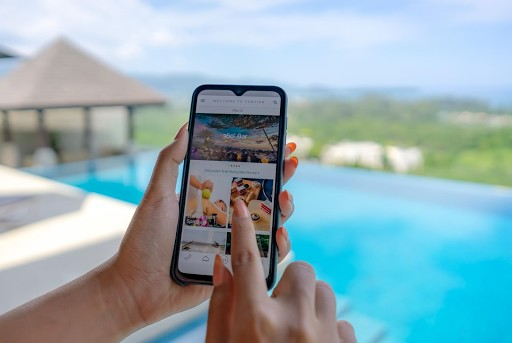
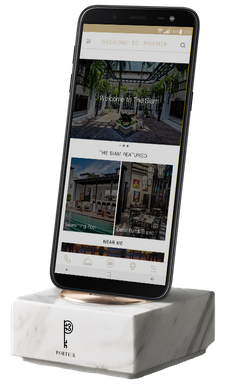
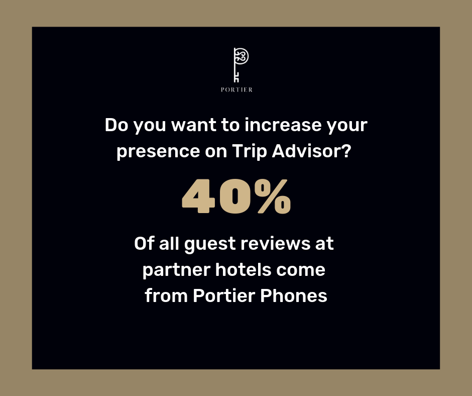

	<section id="one">
		

			<ul class="actions">
				<li>
Product Marketing
</li>
				<li>
Data Visualization
</li>
				<li>
SaaS / IoT
</li>
				<li>
Hotel Tech
</li>
				<li>
B2B Sales
</li>
			</ul>
      <header class="major">
				<h2>Background</h2>
			</header>
      
<i><a href="http://goportier.com">Portier Technologies</a> is a hotel and data analytics company based in Hong Kong that helps luxury five star hotels in SE Asia to engage their guest and drive revenue using white labelled Samsung devices available in guest bedrooms.</i>

			
In 2019, Portier Technologies was expanding rapidly and needed support to help bring together and support and connect different sides of the business from sales and marketing to product and technology. This case study will outline how I helped them to:
	    <ul>
	    <li>Support their sales teams</li>
	    <li>Revamp their marketing branding and messaging</li>
	    <li>Help hotel GMs better understand how to engage their guests</li>
	    </ul>

		

	</section>
<section id="two" class="spotlights">
	<section>
		
		

			

				<header class="major">
					<h3>Problem</h3>
				</header>
				
I initially began working with Portier Technologies because I wanted to learn and see what the culture of a sales oriented company looked like. From my time at Rikai Labs, I realized that the company was exteremly strong in product and technology, but lacked the strong sales culture needed to truly grow the business. So I joined Portier Technologies to learn from their:
        <ul>
	        <li>Strong sales cultures grow</li>
					<li>Further refine B2B sales process</li>
	        <li>Build and scale a distributed team</li>
				</ul>

			

		

	</section>
  <section>
		
		

			

				<header class="major">
					<h3>Persona</h3>
				</header>
				
Initially I was going to help them on User Experience and Product, but I quickly saw that I would be of most use to help to empower their Marekting and messaging specifically around Product Marketing. I began by working with the sales, technology and design teams to determine understand the following:
				<ul>
					<li>Product capability</li>
					<li>Sales process</li>
					<li>Product value and USP to perspective buyers</li>
				</ul>

				<header class="major">
					<h3>Process</h3>
				</header>
				
After spending time with product, marketing and sales, I quickly built out a strategy that would help us to better sell by:
				<ol>
					<li>Rebranding the website and sales collateral</li>
					<li>Repositioning the company and product messaging</li>
					<li>Building product dashboards that were aligned with customer KPIs</li>
					<li>Building out SEO, email and content strategy that was on brand, on message, and consultative for Hotel GMs</li>
				</ol>

			

		

	</section>
	<section id="three">
		
		

			

				<header class="major">
					<h2>Results</h2>
				</header>
				
My time with Portier resulted in the following:
				<ul>
					<li>Rebuild, rebranded company website, branding and messaging bible</li>
					<li>500% increase in leads generated from website</li>
					<li>300% increase in leads generated from email</li>
					<li>Launched chat and messaging products</li>
				</ul>

			

		

	</section>
