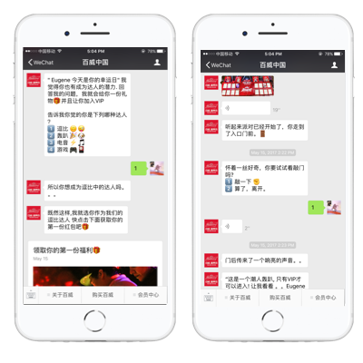
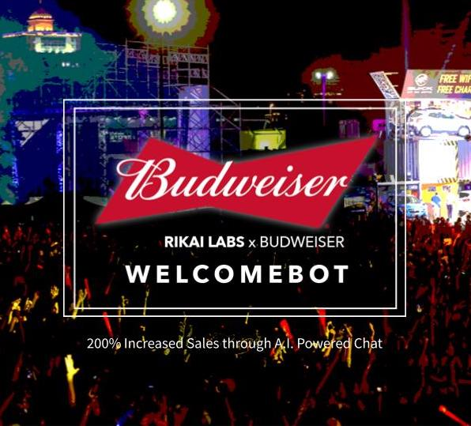

	<section id="one">
		

			<ul class="actions">
				<li>
Product Development
</li>
				<li>
Startups
</li>
				<li>
A.I.
</li>
				<li>
Chatbots
</li>
				<li>
China
</li>
				<li>
Go to market
</li>
			</ul>
			<header class="major">
				<h2>Background</h2>
			</header>
				
Rikai Labs was a venture backed A.I. SaaS startup based in Shanghai that blended chatbots powered by A.I. with live people to scale one on one interactions between teachers, brands and customer support in WeChat. The company started as a B2C English language company, but eventually found its product market fit by pivoting into a B2B company that licencsed its SaaS solutions and products to Fortune 500 companies in Shanghai  sthat looked to increase engagement in their Official WeChat accounts.
					In the case study below, I will describe the process that helped us to launch our <b>WelcomeBot</b> product

			<header class="major">
				<h2>Problem</h2>
			</header>
			
Every year companies spend billions of dollars in China to acquire users to follow their official WeChat Accounts. The hope is that these acquired users will be onboarded to the brand, will provide additional customer data and ultimately return to buy something from their e-commerce store. The problem, however, is that most brands in China official WeChat accounts only provided a general, boring welcome message with a weak onboarding brand experience, and calls to action that ultimately don't incentivize customers to return to the channel. The results of many traditional WeChat campaigns were:
	    <ul>
	    <li>Very little user data collected</li>
	    <li>Extremely high CAC</li>
	    <li>Tiny e-commerce sales</li>
	    </ul>

		

	</section>
<section id="two" class="spotlights">
	<section>
		
		

			

				<header class="major">
					<h3>Solution</h3>
				</header>
				
To fix this problem for brands, my team built our WelcomeBot product with the goal of helping brands to:
        Create a dynamic, personalized brand onboarding experience
        Help brands learn more about their customers
        Increase sales
        Decrease CAC via gamified social viral sharing

        My core team consisted of:
        <ul>
        <li>Product Marketing</li>
        <li>UX</li>
        <li>Content / marketing</li>
        <li>Chatbot scripters</li>
        <li>Engineers (NLP, platform and integration engineers)</li></ul>

        
Each WelcomeBot consisted of 3 critical steps in the user journey.
        Use chat to onboard users to identify a user persona. (capture additional data)
        Present each user a "sharable" piece of content based upon persona (social virality, customer acquisition)
        Present an item in the e-commerce store based up persona (increase revenue)

			

		

	</section>
  <section>
			
		

			

				<header class="major">
					<h3>Product launch and case study</h3>
				</header>
				
In order to launch this product successfully, we needed a trophy brand to adopt the product to give WelcomeBot the product the visibility, credibility and traffic to make WelcomeBot attractive to other customers.

        
I approached the marketing team at Budweiser and pitched them the idea for an exclusive product launch to help Budweiser onboard people to their WeChat fan club and increase sales in their e-commerce store. They loved the product and idea and agreed to launch the product, but gave us a 2 week window to build, integrate and launch the product. We frantically worked with their marketing team and aligned WelcomeBot with their existing marketing campaign and asked Budweiser users in China -- "Which Type Party Animal Are You?"

        
We drew inspiration from BuzzFeed quizzes and built and structured a simple chatbot conversation that interviewed users and asked them questions about their party habits -- how often they party? who they go with? how many drinks they had? We worked extensively with their social media agency to collect the relevant content and on-brand messaging and marketing collateral, while also working with their social agency's technical team to manage api integration, tokenization, crm, QA and data privacy issues.

        
Lastly, because we were caught in between departments at Budweiser (customer success, marketing, and e-commerce) we worked with each of the different stakeholders in each department so that we could A|B test and derive metrics that were measured against each department's overall KPI.

			

		

	</section>
	<section id="three">
		

			

				<header class="major">
					<h2>Results</h2>
				</header>
				
The results of WelcomeBot exceeded even our own hopes and ambitions. Because we A|B tested the experience in real time, we had clear benchmarks for comparison. After using WelcomeBot we found that:
				<ul>
					<li>522% more people signed up for the fan club campaign</li>
					<li>200% more sales after talking to WelcomeBot</li>
					<li>14% increase in users by using social sharing</li>
					<li>Reduce customer acquisition cost 80%</li>
					<li>62% completion rate of onboarding experience</li>
				</ul>
				<h4>Persona data</h4>
				<ul>
					<li>76% of users have 3+ drinks when they go out the number users</li>
					<li>40% of users identify as the DJ persona	</li>
				</ul>

			

		

	</section>
